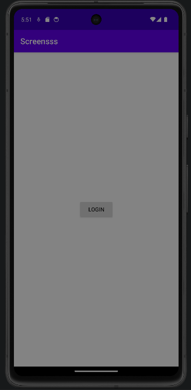
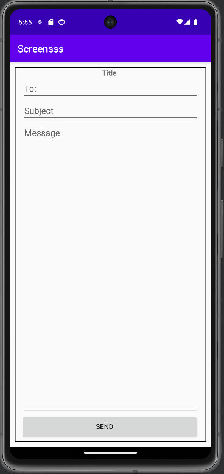

# Rapport

**Screens dugga**

Jag har kombinerat min widgets dugga och denna, så jag kan bygga något av en prototyp av app.

Jag har satt en login knapp som leder till ett mail form, detta kan senare användas som login/support system i min tanke.

Senare kan man lägga till ett login system för att komma åt den andra aktiviteten.

I denna kod nedan så bygger jag mainactivity för att leda till login activity med en knapp. Dessutom ger jag den en extra attribut med namnet Test.
```


 Button button = findViewById(R.id.loginbtn);
        button.setOnClickListener(new View.OnClickListener() { //Skapar knapp

            @Override
            public void onClick(View view) {
                Intent intent = new Intent(MainActivity.this, login.class); //Skapar intent
                intent.putExtra("name", "Test"); //Sätter en name tag med värdet Test 
                startActivity(intent); //aktiverar intent 2 (login)
            }
        });
```





